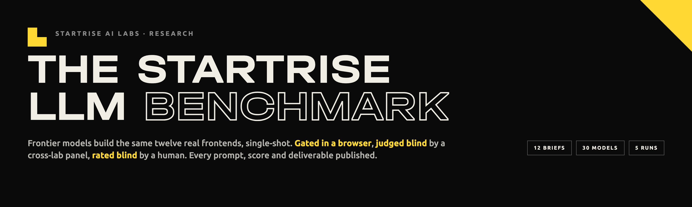
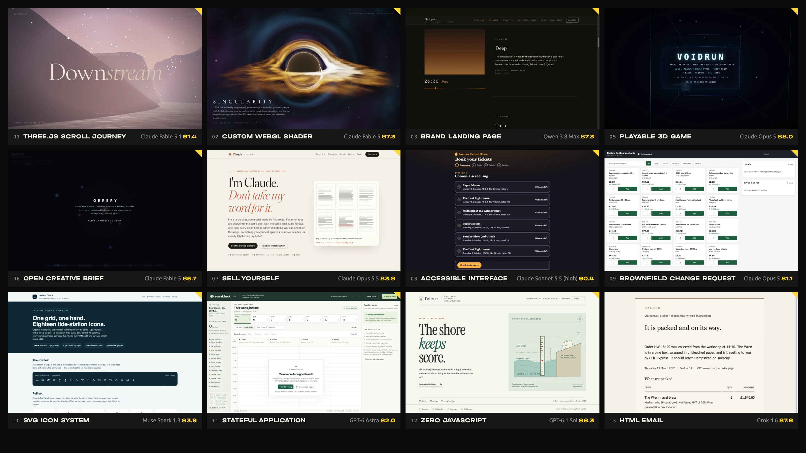
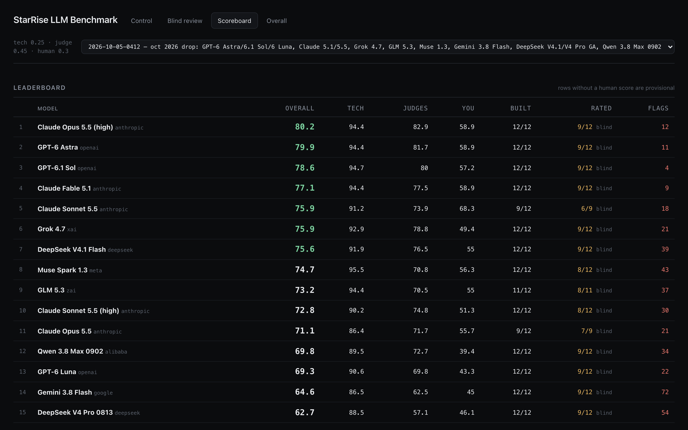
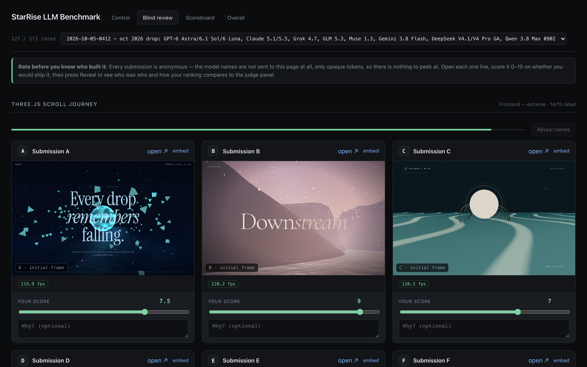
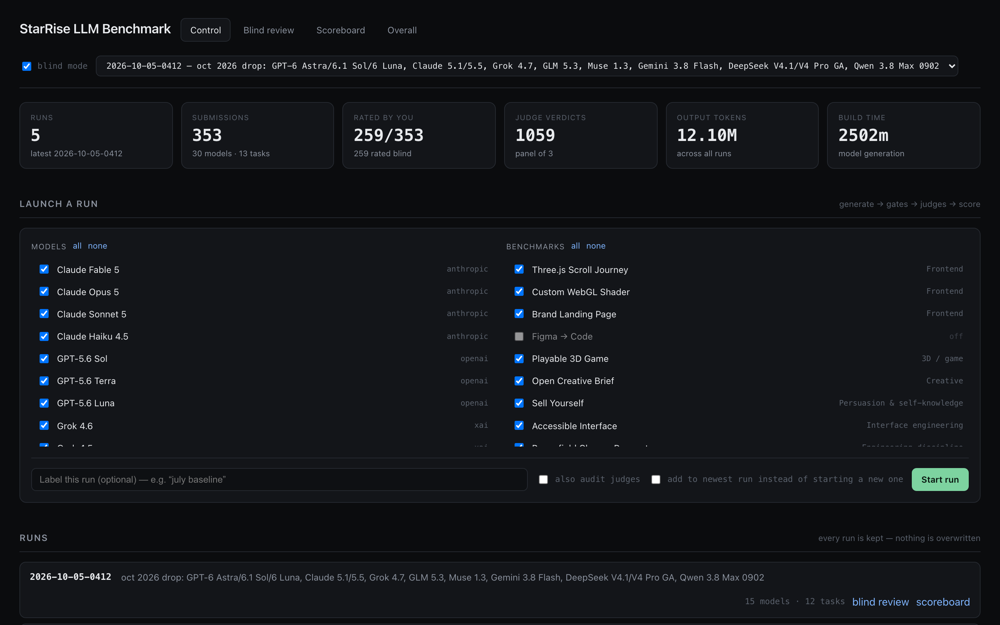
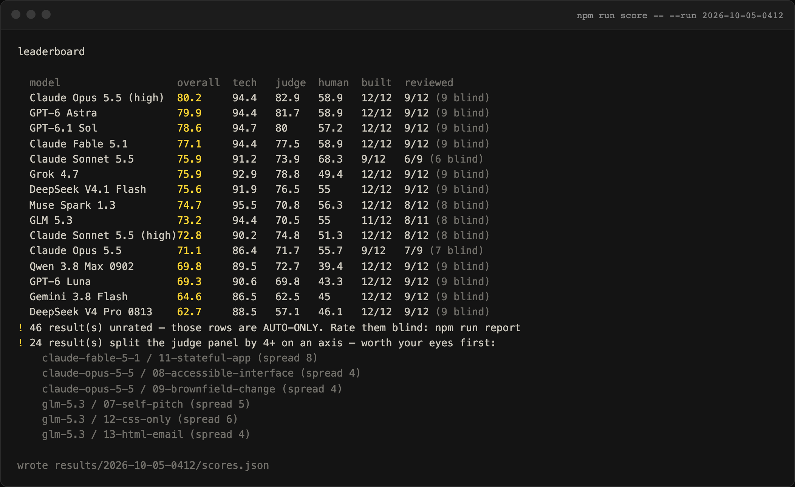

<p align="center">
  
</p>

<h1 align="center">The STARTRISE LLM Benchmark</h1>

<p align="center">
  Frontier models build the same twelve real frontends, single-shot.<br>
  Gated in a real browser. Judged blind by a cross-lab panel. Rated blind by a human. Everything published, including what broke.
</p>

<p align="center">
  <a href="https://www.startrise.io/benchmark/"></a>
  <a href="https://github.com/startriseio/sr-llm-benchmark/actions/workflows/ci.yml"></a>
  
  
  
  
  
  <a href="LICENSE"></a>
</p>

<p align="center">
  <a href="https://www.startrise.io/benchmark/">Live results</a> ·
  <a href="https://www.startrise.io/benchmark/gallery/">Build gallery</a> ·
  <a href="https://www.startrise.io/blog/gpt-6-astra-vs-claude-opus-5-5-benchmark/">Latest write-up</a> ·
  <a href="#how-a-score-is-computed">Method</a> ·
  <a href="#quick-start">Quick start</a> ·
  <a href="#adding-a-model">Add a model</a> ·
  <a href="CONTRIBUTING.md">Contributing</a>
</p>

<br>

<p align="center">
  
  <br>
  <sub>The all-time winner of each brief, as rendered in the gate browser. Every one of these is a single API response: one prompt, one HTML file, no follow-up turn.</sub>
</p>

<br>

## Why this benchmark exists

Most LLM leaderboards are multiple choice. This one makes models **build things**: a Three.js scroll journey, a WebGL shader, a brand landing page, a playable 3D game, a WCAG 2.2 AA cinema seat map, a brownfield change request against a 700-line codebase, an eighteen-glyph SVG icon system, a stateful scheduling app, a page with zero JavaScript, an HTML email that survives Outlook, and two open creative briefs where the model chooses what is worth making.

Every model gets the identical brief and the identical output contract: one self-contained HTML file, CDN references only, runs from `file://`, no placeholders. Whatever comes back is the submission. Then three independent instruments score it:

| Column | Weight | Who decides | What it measures |
|---|---|---|---|
| **Gates** | 25% | Playwright, headed Chromium, real GPU | Loads, renders, holds frame rate, responds to input, stays in one file, keeps the console clean, stays within the size contract |
| **Panel** | 45% | Three LLM judges from three labs, blind | Craft, technical ambition, brief adherence, originality, each 0–10, aggregated by **median per axis** |
| **Human** | 30% | One reviewer, blind | Would you ship it? Model names are stripped from the review UI until every cell in a brief is rated |

Automated checks and judge ratings are limited measurements, not a complete assessment of quality. You can open any deliverable, click it, and disagree with the number.

## Where things stand

The public website combines runs using the latest scored leaderboard row per model and the latest present build per (model, brief). The local report’s all-time view instead averages repeated (model, brief) scores across runs. Full table, filters, head-to-head comparator and every deliverable at **[startrise.io/benchmark](https://www.startrise.io/benchmark/)**.

| # | Model | Lab | Overall | Gates | Panel | Human | Built | Run |
|---|---|---|---|---|---|---|---|---|
| 1 | Claude Opus 5 | Anthropic | **82.3** | 93.9 | 81.3 | 71.7 | 12/12 | Jul 2026 |
| 2 | Claude Opus 5.5 (effort high) | Anthropic | **80.2** | 94.4 | 82.9 | 58.9 | 12/12 | Oct 2026 |
| 3 | GPT-6 Astra | OpenAI | **79.9** | 94.4 | 81.7 | 58.9 | 12/12 | Oct 2026 |
| 4 | Kimi K3 | Moonshot | **79.8** | 92.8 | 77.5 | 70.6 | 12/12 | Jul 2026 |
| 5 | GPT-6.1 Sol | OpenAI | **78.6** | 94.7 | 80.0 | 57.2 | 12/12 | Oct 2026 |
| 6 | Claude Fable 5.1 | Anthropic | **77.1** | 94.4 | 77.5 | 58.9 | 12/12 | Oct 2026 |
| 7 | Claude Sonnet 5.5 (effort xhigh) | Anthropic | **75.9** | 91.2 | 73.9 | 68.3 | 9/12 | Oct 2026 |
| 8 | Grok 4.7 | xAI | **75.9** | 92.9 | 78.8 | 49.4 | 12/12 | Oct 2026 |
| 9 | DeepSeek V4.1 Flash | DeepSeek | **75.6** | 91.9 | 76.5 | 55.0 | 12/12 | Oct 2026 |
| 10 | Muse Spark 1.3 | Meta | **74.7** | 95.5 | 70.8 | 56.3 | 12/12 | Oct 2026 |
| 11 | Claude Fable 5 | Anthropic | **73.8** | 89.4 | 71.9 | 59.4 | 12/12 | Jul 2026 |
| 12 | GLM 5.3 | Z.ai | **73.2** | 94.4 | 70.5 | 55.0 | 11/12 | Oct 2026 |

<sub>30 models from 9 labs, 353 deliverables, 1,059 blind judge verdicts, 5 runs. Published cells are single trials, without repeat-trial uncertainty estimates. Small differences and comparisons across runs should be treated cautiously; no statistical significance threshold has been established. A "9/12" row delivered nothing usable on three briefs and is averaged over the nine it built.</sub>

Per-brief winners: Fable 5.1 holds the Three.js record (91.4), Sonnet 5.5 the accessible seat map (90.4), GPT-6.1 Sol the zero-JavaScript page (88.3), Opus 5 the 3D game (88.0) and the brownfield change, Grok 4.6 the HTML email, Qwen 3.8 Max the landing page, Muse Spark 1.3 the icon system, GPT-6 Astra the stateful app, Fable 5 the shader and the open creative brief, Opus 5.5 the self-pitch.

## What's in the box

<table>
<tr>
<td width="50%"><br><sub><b>Scoreboard.</b> Per-run leaderboard with every column, the "built" coverage, blind-rating coverage and judge-named red flags.</sub></td>
<td width="50%"><br><sub><b>Blind review.</b> Submissions are opaque tokens; names are never sent to the page. Rate everything in a brief, then press Reveal.</sub></td>
</tr>
<tr>
<td><br><sub><b>Control centre.</b> Pick models and briefs, launch a run, watch it live. Every run is kept; nothing is overwritten.</sub></td>
<td><br><sub><b>CLI.</b> The same pipeline from the terminal: <code>generate → gates → judge → score</code>, with split-panel cells surfaced first.</sub></td>
</tr>
</table>

## How a score is computed

Per cell (one model, one brief):

```
final = 0.25 × gates + 0.45 × panel + 0.30 × human
```

- **Gates** is the weighted mean of only the checks a brief declares. A static landing page has no `fps` gate, so its absence costs nothing. Two checks beyond the obvious: **economy** (the contract sets a working size of ~800 lines / 50 KB; score tapers to zero at 2.5×) and **identity** (on the self-pitch brief only: does the page name its own author correctly, checked by regex so the judges never learn who wrote what).
- **Panel** takes the median per axis across the three judges, averages the four medians, and keeps the spread. A cell where judges differ by four or more on an axis is flagged `split panel` and surfaced first.
- **Human** is a blind 0–10. If a cell is unrated the weight is redistributed across the other two and the row is marked provisional everywhere.

Per model, per run: the mean of its finals over the briefs it **delivered**. An empty response shrinks the sample instead of scoring zero, and the coverage is always shown next to the number.

In the local report’s all-time view, each (model, brief) pair is averaged over every run it appears in, then across active briefs. The public website uses the latest scored model row rather than this pooled mean. Self-pitch (07) is included in the implemented overall scores; disabled Figma-to-code (04) is excluded. See [`benchmarks/SCORING.md`](benchmarks/SCORING.md) for the implemented method and a separately labelled proposed protocol and [`config/scoring.json`](config/scoring.json) for what actually runs.

## The twelve briefs

| # | Brief | What it separates |
|---|---|---|
| 01 | **Three.js Scroll Journey** | Scroll choreography, real GLSL, authored vs mechanical |
| 02 | **Custom WebGL Shader** | Open brief: the coolest shader the model can write |
| 03 | **Brand Landing Page** | Taste. Typography, palette, restraint; penalises default-AI aesthetics |
| 05 | **Playable 3D Game** | A complete loop, game feel, collision, frame-rate independence |
| 06 | **Open Creative Brief** | No subject at all. Half the score is what the model chose to build |
| 07 | **Sell Yourself** | The model markets itself. Self-knowledge, persuasion, honesty under pressure |
| 08 | **Accessible Interface** | A cinema seat map to WCAG 2.2 AA: the hardest common a11y widget |
| 09 | **Brownfield Change Request** | Three tickets against an existing 700-line file. Scored on the diff |
| 10 | **SVG Icon System** | Eighteen icons by hand, one grid, one hand, a node budget |
| 11 | **Stateful Application** | A scheduler with real rules: undo/redo, bulk ops, keyboard parity |
| 12 | **Zero JavaScript** | No `<script>` at all. Closes the gap where everything else can be won with flexbox |
| 13 | **HTML Email** | Tables, MSO conditionals, no images. Knowledge you can't reason out |

Brief 04 (Figma to code) exists but is disabled: it needs an agentic harness and measures the harness, not the model. Every brief is plain markdown in [`benchmarks/`](benchmarks/), joined at prompt time with [`_contract.md`](benchmarks/_contract.md). Brief 09 ships a frozen fixture in [`fixtures/09-brownfield/`](fixtures/09-brownfield/) with one genuine bug and a behaviour change scattered across a dozen call sites.

The published briefs are now in the training window of every model released after July 2026. That is a known cost of publishing them; the next full re-run adds a private holdout.

## The judge quorum

One LLM judge is a single point of failure with a single set of blind spots. The panel is three models from three labs, each with a different lens:

| Judge | Model | Lens |
|---|---|---|
| **Craft** | Claude Opus 5 | An award-jury design director. Composition, typography, colour, motion, whether the thing has a point of view |
| **Engineering** | GPT-5.6 Terra | A graphics engineer reading the source: real shader maths vs a CSS gradient, real physics vs a hardcoded tween |
| **Brief** | Grok 4.5 | The client who wrote the brief, checking every stated requirement one by one |

Judges see screenshots, the full source and the gate measurements, and never learn which model produced a submission. Because judges and contestants overlap, `npm run audit` makes every rostered model score every submission and measures each one's **self-bias** and **vendor bias** net of its leniency. The July audit (839 calls) is in [`docs/STUDY.md`](docs/STUDY.md) and on the website; Opus 5's vendor bias measured −0.46, which is why the top of the board is described as a cluster rather than a win.

## Quick start

Browse published scores without provider keys or model calls:

```bash
git clone https://github.com/startriseio/sr-llm-benchmark.git
cd sr-llm-benchmark
npm install                 # also fetches Chromium for Playwright
npm test
npm run score               # reads the latest published snapshot, leaves it unchanged
npm run report              # http://localhost:4321, scoreboard and history
```

To reproduce generation or judging, copy `.env.example` to `.env` and add provider keys. `npm start`, `npm run bench`, `npm run gen`, `npm run judge` and `npm run audit` can make paid API calls. The report’s control centre can also launch paid runs when keys are configured.

`npm start` lists every model with a key, shows how much of the suite each has already completed and how much you have rated, and pre-selects the ones with gaps. It prints the exact `npm run bench` command before it starts anything.

For the browser instead:

```bash
npm run report              # control centre at http://localhost:4321
```

Direct CLI, one stage or all of them:

```bash
npm run bench -- --model gpt-6-astra --note "new model just dropped"   # generate → gates → judge → score
npm run bench -- --all --run latest                                     # top up the newest run
npm run gen   -- --model glm-5.3 --concurrency 4                        # one stage, throttled
npm run audit                                                           # judge-bias audit on the self-pitch brief
```

A fresh clone has no local deliverables under `runs/`, because the deliverables are hundreds of megabytes per run. The scoreboard, the all-time view and the blind-review page fall back to the published `results/<run>/scores.json`, so score tables and history render out of the box; local blind review needs local deliverables, and the published live builds and screenshots are at [startrise.io/benchmark](https://www.startrise.io/benchmark/).

> **Gates run headed, on a real GPU, serially by design.** Parallel pages fight over the GPU and corrupt the frame-rate measurement. Leave the machine alone during the gates stage.

## Repository layout

```
benchmarks/        the twelve briefs, the output contract, SCORING.md
config/            models.json (the roster) · benchmarks.json · judges.json · scoring.json
fixtures/          frozen inputs for briefs that modify an existing file (09)
src/               the pipeline: generate → gates → judge → score, plus audit, report UI, CLI
scripts/           probes and the config validator (npm test)
results/           per-run published data: scores.json, human.json, judge-audit.json, runs.json
runs/              per-run deliverables and per-cell gate/judge/meta files (git-ignored)
docs/              STUDY.md (the July write-up), COST.md (the economics), README assets
```

Every run lives forever under `runs/<runId>/<model>/<brief>/` with the deliverable, `meta.json` (tokens, latency, contract violations), `gates.json`, `judge.json` and three screenshots. Nothing is overwritten; a new model gets a new run and the all-time view pools them.

## Adding a model

One entry in [`config/models.json`](config/models.json), then `npm run bench -- --model <id>`.

```jsonc
{
  "id": "some-new-model",
  "label": "Some New Model",
  "provider": "openai-compatible",       // or "anthropic", or "manual"
  "model": "vendor/some-new-model",
  "baseURL": "https://openrouter.ai/api/v1",
  "apiKeyEnv": "OPENROUTER_API_KEY",
  "vendor": "somelab",                   // used for vendor-bias detection
  "params": { "max_tokens": 128000 }     // passed through verbatim
}
```

Three things the roster taught us, all documented in the `$comment` of the entry that taught them:

- **Give reasoning models the whole output ceiling.** GLM, Muse, Qwen and the Claude 5.5 family reason inside `max_tokens`. At 64k they return empty bodies with `finish_reason: length`; at 128k they complete. If the ceiling is the model's hard maximum and it still runs out, that is a finding, not a configuration bug: in October, Opus 5.5 and Sonnet 5.5 at effort `xhigh` returned nothing on three briefs each, and the same models at effort `high` delivered twelve of twelve. Both configurations stay on the board.
- **Cap concurrency per provider.** Anthropic and OpenRouter reserve each request's worst-case cost against your balance. Firing thirty-six 128k-token streams at once trips the pre-check even with auto-reload on. `--concurrency 8` is safe; the runner reports pool failures only when a stage ends, so check live connections rather than the log.
- **Verify the catalog ID before the run.** `node scripts/probe.mjs` sends one 64-token request to every rostered model and judge. A model that has been silently aliased to a newer snapshot will still answer; put the dated snapshot in the config so the run is reproducible.

`provider: "manual"` covers models with no public API (Cursor Composer): `npm run manual -- --model <id>` writes every brief, byte-identical to what the API models received, into the run folder and tells you where to drop the output. Scoring is identical.

## What this can't tell you

- **Sample size is one.** Every brief ran once per configuration. There are no error bars.
- **Cross-run gaps carry extra noise.** The human column is blind but rated in separate sessions per run.
- **Single-shot only.** Nothing here measures iteration, tool use, or what a harness like Claude Code or Cursor would make of the same brief. A one-shot syntax error that a harness would fix in seconds scores as a broken page here, on purpose.
- **The judge panel shares vendors with the field.** The audit measures the bias; it does not remove it.
- **The briefs are public** and are therefore in the training window of every model that shipped after July 26, 2026.

The full list, including every measurement defect we found and fixed, is in the *What broke* section of the [live page](https://www.startrise.io/benchmark/#broke).

## Write-ups

- [GPT-6 Astra vs Claude Opus 5.5: The October Benchmark Drop](https://www.startrise.io/blog/gpt-6-astra-vs-claude-opus-5-5-benchmark/) — 13 new models, the `xhigh` ceiling finding, generation-over-generation deltas
- [Twelve Models, Twelve Briefs: The Full Study](https://www.startrise.io/blog/llm-frontend-benchmark/) — the July baseline, method and bug list ([`docs/STUDY.md`](docs/STUDY.md))
- [LLM-as-a-Judge Bias: The 839-Call Audit](https://www.startrise.io/blog/llm-judge-bias/) — self-bias and vendor bias for ten judges
- [What Twelve Models Cost](docs/COST.md) — why the rate card is not the bill
- [Grok 4.6 vs Qwen 3.8 Max](https://www.startrise.io/blog/grok-4-6-vs-qwen-3-8-max/) and [Muse Spark 1.2](https://www.startrise.io/blog/muse-spark-1-2-benchmark/) — the August additions

## Contributing

New models, new briefs, harness fixes and reports of measurement defects are all welcome. Read [CONTRIBUTING.md](CONTRIBUTING.md) first: the twelve published briefs, the brief-09 fixture and the scoring weights are frozen for comparability, and anything that changes a score needs a re-score with the before/after attached. Security concerns, including anything about executing model-generated deliverables, go to [SECURITY.md](SECURITY.md).

## Citation

If you use the harness or the published results, please cite the repository ([`CITATION.cff`](CITATION.cff)) and link the run id you used.

## License

[MIT](LICENSE) © 2026 Startrise LLC. Model-generated deliverables under `runs/` are the output of third-party models and are published for inspection; their licensing follows the respective providers' terms.

<br>

<p align="center">
  <sub>Built by <a href="https://www.startrise.io/ai-labs/">Startrise AI Labs</a>. We benchmark before we build.</sub>
</p>
